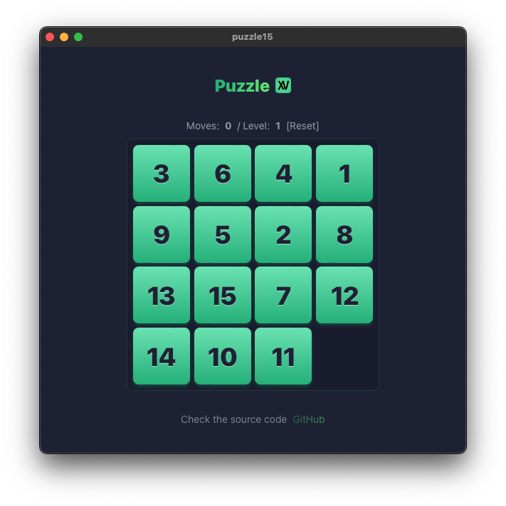

# 15 Puzzle Game

### Stack

`React` `TypeScript` `Vite` `Tailwind CSS`

### Demo https://15.floatrx.net/

Simple puzzle game with a 4x4 grid of numbered tiles. The goal is to arrange the tiles in numerical order by moving them into the empty space.

# Tauri

Docs: https://tauri.app/

Rust is required to build the Tauri app. Install Rust with 
`curl --proto '=https' --tlsv1.2 -sSf https://sh.rustup.rs | sh`

### Build app
``sh
bun run tauri build 
``

### Run app
``sh
bun run tauri dev 
``
